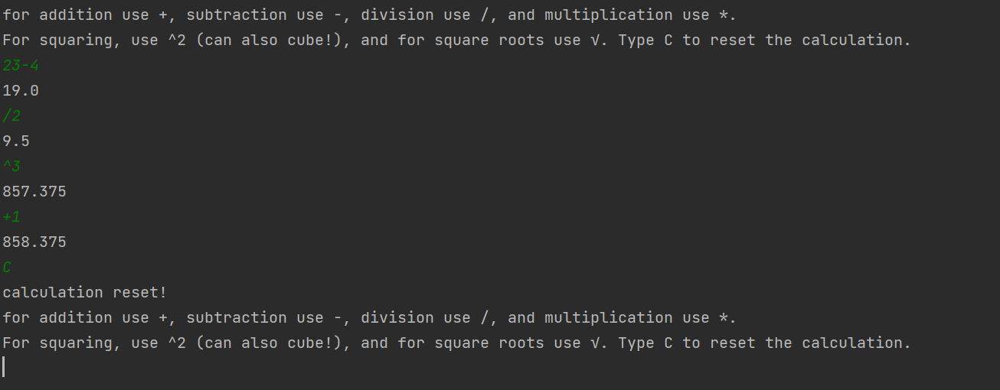

# Java Library

---

## Table of Contents
- [Brief](#brief)
- [About](#about)
- [Screenshots](#screenshots)
- [Languages](#languages)
- [Code of Note](#code_of_note)

---

## Brief 

1. Build and test a calculator in Java
- Addition, subtraction, multiplication & division
- Chained operations (e.g. 5 + 17 \* 3)
- Numbers squared and square rooted
- Ability to handle negative numbers   -- still in progress
- Ability to handle decimal numbers

---

## About 

A java calculator which can perform chained operations including addition, subtraction, multiplication, division, multiplying by powers, and square rooting. The calculation can be reset using "C".

---

## Screenshots 

---

## Languages 

- Java

---

## Code of Note 

- Splitting user's input using regex and having overloaded calculation methods to deal with various types of input
- All tests pass

## Still working on...

- Handling negative numbers